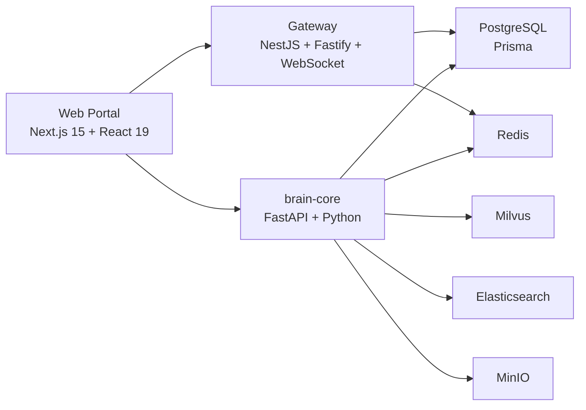

# DreamHelper

## DREAMVFIA UNION v4.0.0-alpha

```text
 ____                              _   _      _                 
|  _ \ _ __ ___  __ _ _ __ ___    | | | | ___| |_ __   ___ _ __ 
| | | | '__/ _ \/ _` | '_ ` _ \   | |_| |/ _ \ | '_ \ / _ \ '__|
| |_| | | |  __/ (_| | | | | | |  |  _  |  __/ | |_) |  __/ |   
|____/|_|  \___|\__,_|_| |_| |_|  |_| |_|\___|_| .__/ \___|_|   
                                                  |_|             
```


> Brand showcase and engineering baseline for the **DreamHelper** workspace inside the **DREAMVFIA UNION** ecosystem.


---

## 🚀 What's New in v4.0.0-alpha
- **Semantic Skill Routing (RAG-for-Skills)**: Replaced the static 100+ prompt-polluting skills dispatching with a zero-latency `BatchEmbedder` contextual integration. Agents now receive `Top-5` dynamically retrieved skills perfectly matched to their current task—drastically reducing hallucinations and saving thousands of tokens.
- **Deep Dual-Brain Agent Engine**: Fully integrated the analytical Left Brain, systemic Right Brain, proactive Thalamus, and reflex Brainstem into a unified dynamic context loading mechanism via `ToolRegistry`.
- **Local-first MCP Foundation**: Hardcoded local tool systems (`shell_exec`, `file_edit`) are transitioning to the standardized Model Context Protocol (MCP) spec natively.

---

## What this repo is

DreamHelper is a monorepo for an enterprise-style AI workspace:

- **Next.js 15 / React 19 web portal**
- **NestJS gateway** for health, channels, websocket, and orchestration edges
- **FastAPI brain-core** for agents, skills, memory, workflows, RAG, and multimodal services
- Supporting packages for **auth**, **database**, **design system**, **logger**, **storage**, and **TypeScript SDK**

This repository is currently positioned as a **DREAMVFIA brand showcase + runnable technical base**, not as a community-first open source product.

---

## Current stable showcase path

If you want the fastest credible demo path, use this order:

1. **Landing page** → `/`
2. **Login / Register** → `/login` / `/register`
3. **Core chat workspace** → `/chat`
4. **Representative dashboard surface** → `/overview` or `/workflows`
5. **Admin surface** → `/admin/login` then `/admin`

---

## Capability status

### Ready for brand showcase

- Landing site and product-facing pages
- Auth route surface in the web portal
- Chat, knowledge, workflow, dashboard, and admin UI surfaces
- Gateway build + unit tests
- Web portal build + API smoke tests

### Available but infra-dependent

- PostgreSQL-backed auth and persistence
- Redis, Milvus, Elasticsearch, and MinIO integrations
- brain-core agent, memory, workflow, and RAG modules
- Docker-based full stack startup

### Not the default demo path

- Experimental / deeper AI surfaces such as consciousness, dual-brain, and broader multimodal stacks
- Any flow that depends on a fully provisioned local AI/data environment before the base app is stable

---

## Engineering baseline

Use these versions if you want reproducible local results:

- **Node.js 20.x**
- **pnpm 9.x**
- **Python 3.12** for `services/brain-core`
- **Docker Desktop / Docker Compose**

Repo helpers:

- `/.nvmrc`
- `/.node-version`
- `/services/brain-core/.python-version`

---

## Quick start

### 1) Clone

```bash
git clone https://github.com/DREAMVFIAUNION/dreamhelper-v3.git
cd dreamhelper-v3
```

### 2) Install workspace dependencies

```bash
pnpm install --shamefully-hoist
```

> The install flow now regenerates Prisma Client automatically via `postinstall`.

### 3) Configure environment

```bash
cp .env.example .env
```

At minimum, set the URLs / secrets you need for your local scenario.

### 4) Start infrastructure

```bash
docker compose up -d postgres redis milvus elasticsearch minio
```

### 5) Database setup

```bash
pnpm db:migrate
pnpm db:seed
```

### 6) Run the main app surfaces

#### Web portal

```bash
pnpm --filter @dreamhelp/web-portal dev
```

#### Gateway

```bash
pnpm --filter @dreamhelp/gateway dev
```

#### brain-core

See [`services/brain-core/README.md`](services/brain-core/README.md) for the Python 3.12 setup flow.

---

## Validation commands

### Web portal

```bash
pnpm --filter @dreamhelp/web-portal test
pnpm --filter @dreamhelp/web-portal build
```

### Gateway

```bash
pnpm --filter @dreamhelp/gateway test
pnpm --filter @dreamhelp/gateway build
```

### brain-core stable smoke suite

```bash
cd services/brain-core
python -m pytest tests/test_smoke.py tests/test_service_entrypoint.py -q
```

### brain-core extended suite

```bash
cd services/brain-core
python -m pytest tests -q
```

Or from the repo root:

```bash
pnpm verify:web
pnpm verify:gateway
pnpm verify:brain
```

---

## Architecture



---

## Roadmap

- See [`docs/ROADMAP_v4.0.md`](docs/ROADMAP_v4.0.md) for the planned v4.0 upgrade path, which focuses on **DREAMVFIA Fusion 2.0** (advanced dual-brain and cerebellar mechanism) and **Skill Tree Optimization** (dynamic semantic retrieval and MCP).

---

## Verified repository surfaces

### Web routes and APIs

- `GET /api/health`
- `POST /api/auth/login`
- `POST /api/auth/register`
- `GET /api/auth/me`
- `POST /api/chat/completions`
- `GET /api/chat/models`
- `GET /api/skills`
- Dashboard / admin / workflow pages under the App Router

### Gateway

- `GET /api/v1/health`
- Channel service adapter registration and routing tests

### brain-core

- Main service entry at `services/brain-core/src/main.py`
- Large module surface for agents, chat, tools, memory, workflows, RAG, multimodal, and MCP

---

## Demo links

- [YouTube Shorts demo](https://youtube.com/shorts/sBnOLkFhz-I?si=4K-JQQNdQtD3DQ2Z)
- [YouTube full demo](https://www.youtube.com/watch?v=Yct5YYgZeJU&t=277s)

---

## Known limits

- `brain-core` local setup is **Python 3.12-only** for now; Python 3.14 is not part of the supported baseline
- Full-stack AI features depend on infra + API keys; they are not all part of the default showcase path
- The repo is optimized first for **stable demonstration and brand presentation**, then for deeper capability expansion

---

## Project links

- GitHub org: [DREAMVFIAUNION](https://github.com/DREAMVFIAUNION)
- Repository: [dreamhelper-v3](https://github.com/DREAMVFIAUNION/dreamhelper-v3)
- Releases: [GitHub Releases](https://github.com/DREAMVFIAUNION/dreamhelper-v3/releases)
- Discussions: [GitHub Discussions](https://github.com/DREAMVFIAUNION/dreamhelper-v3/discussions)

---

## License

This repository is currently managed as a **proprietary DREAMVFIA UNION project**.
